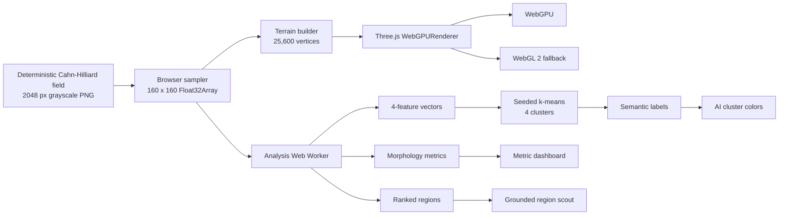

# Technical architecture

## Stack

- TypeScript 5.9 and Vite 7.3
- Three.js r180 `WebGPURenderer`
- WebGPU by default, automatic WebGL 2 backend fallback
- Native Web Worker for morphology analysis
- Static assets and static deployment; no backend or remote API

## Data and rendering path

## Geometry

The browser downsamples the 2048 × 2048 source to 160 × 160 samples. Every sample becomes one terrain vertex. Adjacent samples form two indexed triangles, for 50,562 triangles total. Horizontal extent is 2.56 scene units, interpreted as 2.56 μm. The relief control changes only display height; it does not modify the source values or reported measurements.

Vertex colors are recomputed for three views:

1. **Phase field:** continuous composition color with interface emphasis.
2. **AI clusters:** four categorical colors based on semantic cluster labels.
3. **Interfaces:** dark phase interiors with bright transition boundaries.

## Worker analysis

The analysis worker receives a copied `Float32Array` through a transferable buffer. For each sample it computes:

1. normalized composition;
2. central-difference gradient magnitude;
3. absolute five-point Laplacian;
4. 3 × 3 local variance.

Each feature column is standardized before deterministic farthest-point initialization and k-means iterations. Raw clusters are mapped to low-composition interior, transition, interface, and high-composition interior using their centroids. No class names are used during fitting.

The worker also calculates:

- thresholded phase fraction;
- interface density using a gradient threshold;
- median run-length domain scale;
- structure-tensor anisotropy;
- normalized 32-bin entropy;
- wrapped connected components;
- relative cluster-assignment certainty.

Three objective-specific rankers combine normalized feature evidence and apply spatial non-maximum suppression. Every region shown in the UI includes its gradient, curvature, and rarity values.

## Privacy and security

The app makes no external requests after its static files load. It has no form, storage, authentication, cookie, tracker, analytics SDK, or API key. The field and analysis stay inside the browser process.

## Performance characteristics

Analysis runs once after load in a Worker so controls and rendering remain responsive. The production build contains a separate worker chunk. Pixel ratio is capped at 2, and the terrain resolution is bounded at 25,600 vertices to keep integrated GPUs usable. Exact frame rate and analysis time vary by device.
